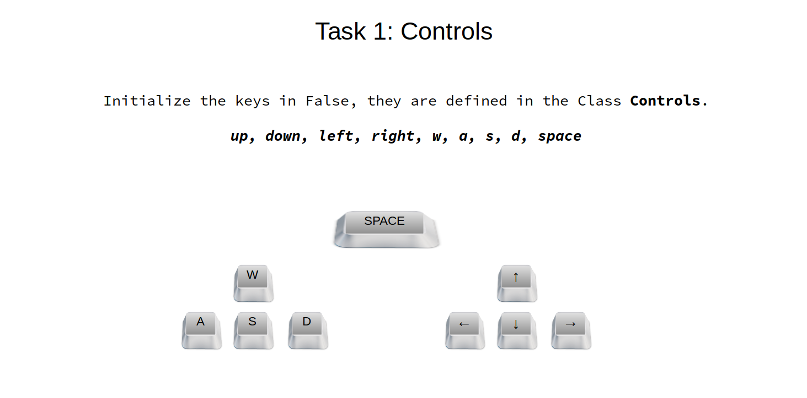
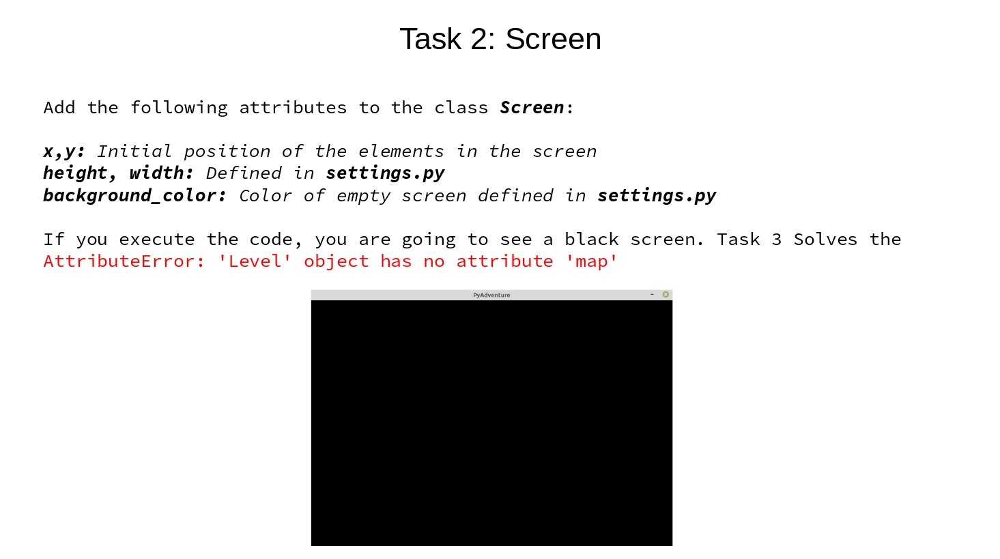
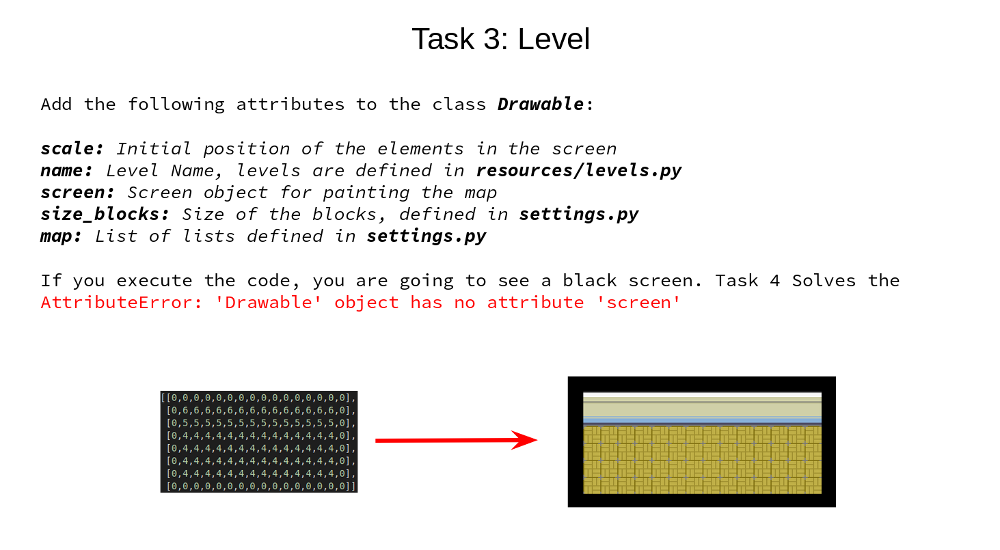
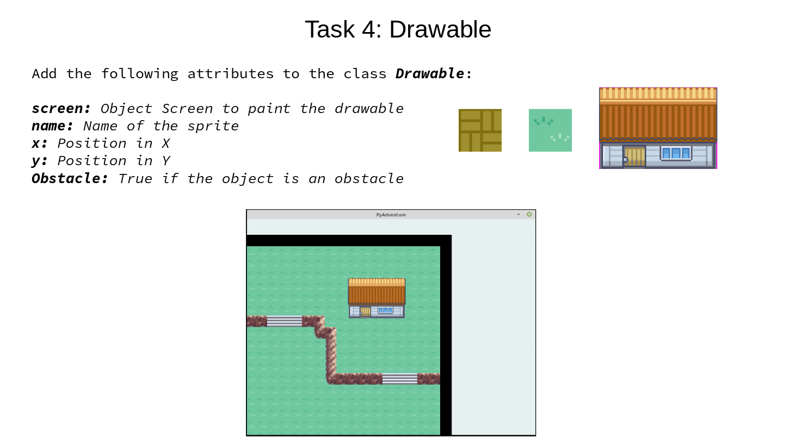
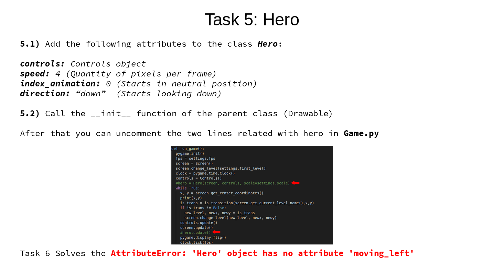
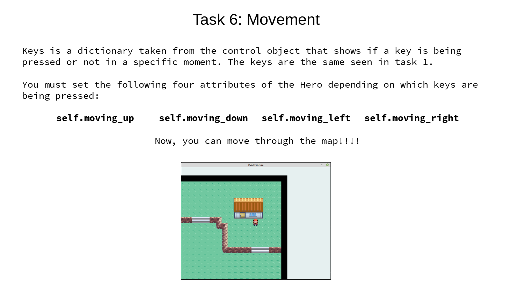
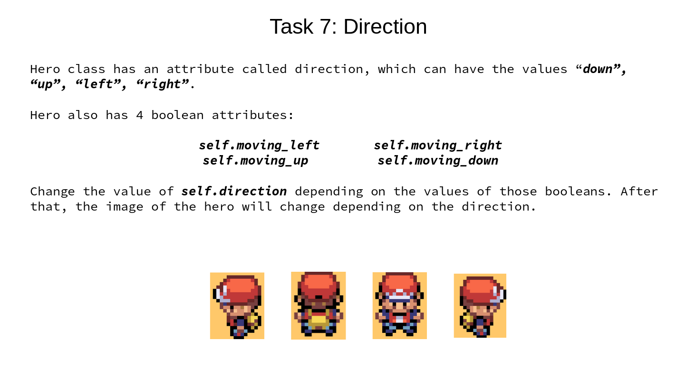
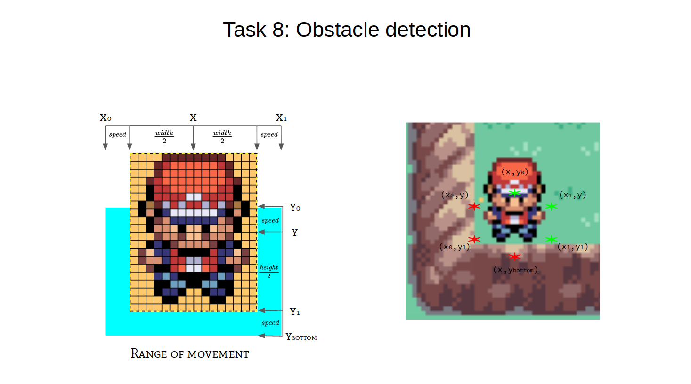
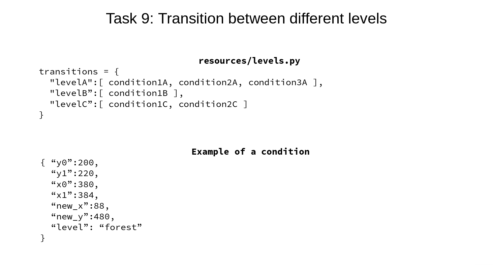

# Python Basics Gamified

Final Project in course: Basics of Programming with Python.

## Tasks

Now you can enter to the house :D

## Pre-requisites

    $ conda create -n pyadventure python=3.5  
    $ conda activate pyadventure  
    (pyadventure) $ pip install pygame  

## Usage

    (pyadventure) $ python Game.py